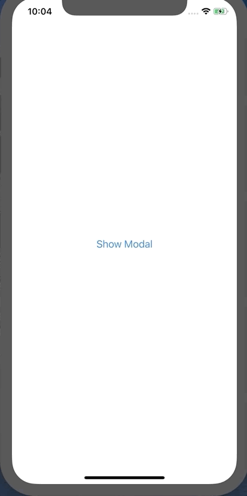
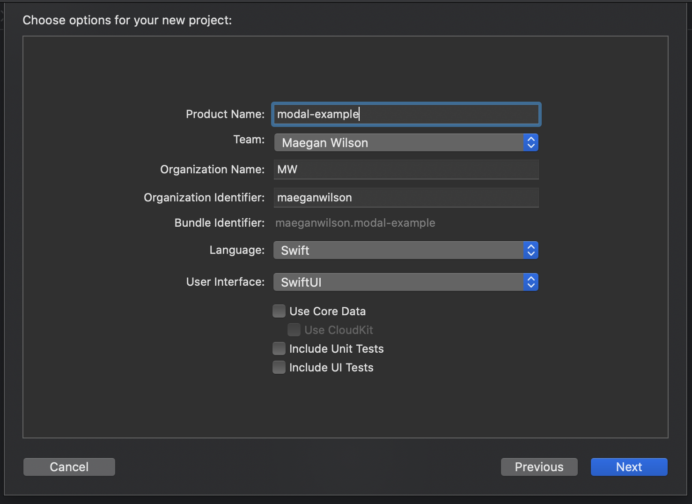

# How to Present and Dismiss a Modal in SwiftUI

In this post, we will cover how to present and dismiss a modal view.

**NOTE**: this tutorial is using **Xcode 11 beta 6** and has been tested using **iOS 13 developer beta 8**.

Let's get started with making a new project using SwiftUI. When creating a new project, make sure that the language is set to Swift and the User Interface is set to SwiftUI like in the picture below.

